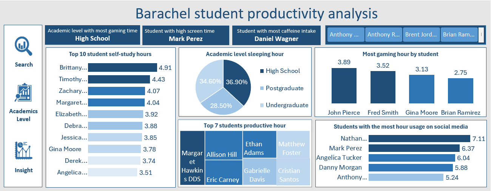

# Barachel_Student_Productivity_Analysis

## Dashboard Overview

---

## Project Summary
This project analyzes student academic performance, daily study habits, lifestyle choices, and digital activity patterns across 59 students. By investigating key metrics such as self-study hours, gaming time, screen time, social media engagement, caffeine consumption, and sleep distributions across academic levels, the analysis delivers actionable insights into student well-being and productivity drivers.

* **Target Audience:** Academic Counselors, Student Affairs, University Administrators, and Educational Data Analysts
* **Dataset Scope:** 59 Student Profiles across High School, Undergraduate, and Postgraduate levels
* **Primary Analytics Focus:** Self-Study Distribution, Screen Time Impact, Lifestyle Indicators (Caffeine & Sleep), and Productivity Factors

---

## Key Performance Indicators (KPIs)
* **Academic Level with Most Gaming Time:** High School
* **Student with Highest Screen Time:** Mark Perez
* **Student with Highest Caffeine Intake:** Daniel Wagner

---

## Core Findings & Analytical Highlights

### 1. Self-Study Leaders (Top Self-Study Hours)
* **Brittany** leads all students with **4.91 hours** of daily self-study.
* Followed by **Timothy (4.43 hrs)**, **Zachary (4.07 hrs)**, and **Margaret (4.04 hrs)**.
* Average self-study time across the total cohort sits at approximately **2.28 hours/day**.

### 2. Academic Level Sleep Distribution
* **High School Students:** Account for **36.90%** of total sleep distribution.
* **Postgraduate Students:** Account for **34.60%** of sleep distribution.
* **Undergraduate Students:** Represent **28.50%** of sleep distribution.

### 3. Digital Distractions & Screen Time
* **Top Social Media Usage:** Led by **Nathan (7.11 hrs)**, followed by **Mark Perez (6.37 hrs)** and **Angelica Tucker (6.04 hrs)**.
* **Top Gaming Hours:** Led by **John Pierce (3.89 hrs)**, followed by **Fred Smith (3.52 hrs)** and **Gina Moore (3.13 hrs)**.
* High School students exhibit the highest average gaming volume among all academic tiers.

### 4. Productivity Leaders
* **Top Productive Students:** Margaret Hawkins DDS, Allison Hill, Ethan Adams, Matthew Foster, Eric Carney, Gabrielle Davis, and Cristian Santos demonstrate the highest relative productivity scores.

---

## Project Variables & Data Dictionary

### Demographics & Academic Profile
* **Student Name:** Unique name identifier.
* **Age & Gender:** Demographic breakdowns (Age range: 16 to 25 years).
* **Academic Level:** High School, Undergraduate, Postgraduate.

### Behavioral & Lifestyle Metrics
* **Study & Self-Study Hours:** Scheduled and independent learning duration.
* **Screen Time & Social Media Hours:** Daily hours spent on digital devices and platforms.
* **Gaming Hours:** Daily time spent gaming.
* **Sleep Hours & Exercise Minutes:** Physical health indicators.
* **Caffeine Intake (mg):** Daily caffeine intake (Range: 4 mg to 480 mg).

### Analytical Scores & Indices
* **Focus Index:** Composite rating evaluating concentration level.
* **Burnout Level:** Measure of physical and cognitive exhaustion.
* **Productivity Score:** Overall evaluated metric of academic output.

---

## Tools & Analytical Methods
* **Microsoft Excel:** Data transformation, exploratory analysis, summary statistics, and structured modeling.
* **Pivot Tables & Calculated Measures:** Formatted metrics for demographic slicing, distribution breakdown, and rankings.
* **Data Visualization & Dashboard Design:** Custom charts (horizontal bar charts, donut chart, treemap) and interactive slicers.

---

## Strategic Recommendations
1. **Targeted High School Digital Balance Programs:** Establish time-management and digital detox workshops tailored for high school students to manage gaming and screen time.
2. **Caffeine & Burnout Awareness:** Implement student wellness initiatives addressing high caffeine consumption (up to 480 mg/day) and its correlation with sleep quality and elevated burnout scores.
3. **Peer Study Workshops:** Encourage peer-to-peer mentoring leveraging high self-study habit frameworks demonstrated by top-performing students like Brittany and Timothy.
